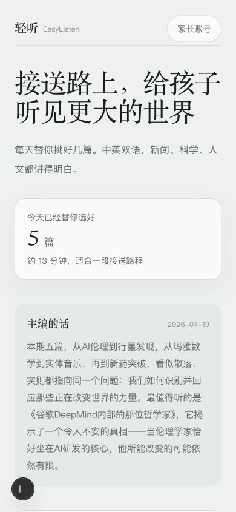
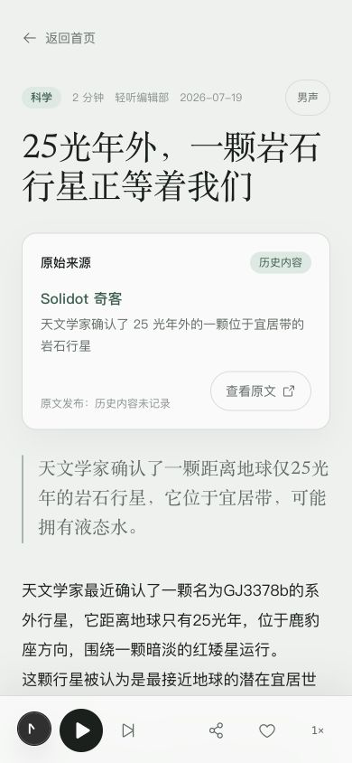
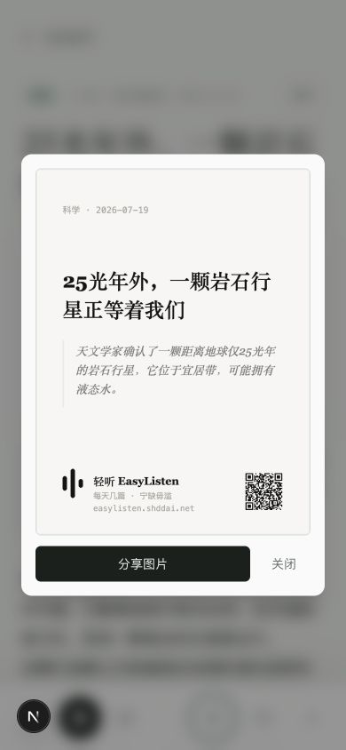

<div align="center">
  
  <h1>轻听 · EasyListen</h1>
  <p><strong>接送路上，给孩子听见更大的世界。</strong></p>
  <p>
    为 6–16 岁孩子的家长，每天挑好几篇真正值得听的内容。<br />
    中英双语，新闻、科学、人文、文化与体育，都讲得明白。
  </p>
  <p>
    <a href="https://easylisten.shddai.net"><strong>在线体验</strong></a>
    ·
    <a href="./docs/product-design-principles.md">产品原则</a>
    ·
    <a href="./content/rubric.md">编辑标准</a>
    ·
    <a href="./docs/source-review-2026-07-19.md">来源审查</a>
  </p>
  <p>
    <a href="https://easylisten.shddai.net"></a>
    
    
    
    
  </p>
</div>

<p align="center">
  
</p>

## 它不是一门课，而是一段更好的相处时间

很多家长想让孩子多听、多看、多了解世界，却没有时间每天筛选信息；孩子面对无限信息流，也很难独立判断什么值得花时间。

轻听把这件费心的事接过来：每天从可信来源中挑出少量内容，重新编辑成适合耳朵理解的听稿。上学、放学或周末出行时，打开就能听。没有课程表，没有任务、积分和打卡，也不制造新的学习压力。

我们希望孩子在放松中慢慢长出几种能力：理解复杂问题的耐心、对世界的好奇、辨别信息的判断力，以及表达自己观点的感觉。

## 为谁而做

| 年龄 | 阶段 | 内容与表达 |
| --- | --- | --- |
| 6–9 岁 | 小学低年级 | 更具体的故事、更短的解释、更清楚的因果关系 |
| 10–12 岁 | 小学高年级 | 扩展知识边界，开始理解机制、背景与不同观点 |
| 13–16 岁 | 初中阶段 | 保留真实世界的复杂度，提供深度、语境与思考空间 |

家长只需选择年龄段与几个兴趣方向。轻听不会收集孩子的姓名、学校、生日或精确位置。

## 轻听只把三件事做好

| | 我们负责 | 产品呈现 |
| --- | --- | --- |
| ① | **挑选** | 从受控源库中召回候选内容，按可信度、信息密度、可听性、年龄适配与领域多样性筛选。低于标准就不收。 |
| ② | **编辑** | 不照读网页，不做生硬摘要。保留事实、语境和不同角度，改写成离开屏幕也能听懂的中文听稿。 |
| ③ | **讲述** | 提供连续播放、逐句高亮、点句跳转、变速、音色切换和中英双语，让收听自然融入一段车程。 |

## 来源清楚，是产品的核心灵魂

一篇内容为什么值得相信，比它听起来是否精彩更重要。

每篇正式听稿必须保留并展示：

- 发布机构与标准来源名称
- 原文标题、原文链接与原始发布日期
- 轻听获取或编辑的时间
- 内容依据状态，例如完整原文、历史内容或其他明确标记
- 可直接打开的“查看原文”入口

当前受控源库包含 **65 个中英文来源**，其中 **21 个为中国大陆来源**，覆盖科学、技术、社会、人文、生活、文化与体育。国内源不是装饰性配额，但数量增加不能换取标准下降。来源按 `realtime`、`analysis`、`depth`、`discovery` 分层管理，发现源只负责提供线索，不能凭热度直接进入正式听稿。

完整规则见 [`content/rubric.md`](./content/rubric.md)、[`content/sources.json`](./content/sources.json) 与 [来源审查记录](./docs/source-review-2026-07-19.md)。策略测试会持续检查来源字段、中文可见度、领域覆盖、时效窗口和正式听稿门槛。

<table>
  <tr>
    <td align="center" width="50%">
      
      <br />
      <sub><strong>边听边读</strong> · 原始来源、逐句高亮与移动播放器</sub>
    </td>
    <td align="center" width="50%">
      
      <br />
      <sub><strong>自然分享</strong> · 自动排版的内容卡片与直达二维码</sub>
    </td>
  </tr>
</table>

## 一个小 App 需要的完整体验

- **每天少量精选**：默认 2–6 篇，宁缺毋滥，适合一段接送路程。
- **中英双语**：只给取得足量完整原文且达到更高质量门槛的内容提供双语稿。
- **移动端优先**：主要体验针对手机 Web 与 PWA，桌面端保持清晰、安静和完整。
- **家长账号**：使用邮箱验证码登录，不设密码；年龄段、兴趣、收藏和收听偏好可跨设备同步。
- **最少儿童数据**：账号属于家长，不建立儿童实名档案，不收集学校、生日等非必要信息。
- **自动出刊可观测**：GitHub Actions 每天自动召回、筛选、改写和发布；失败会创建 Issue，不让断更静默发生。

## 从来源到耳机

```text
受控 RSS / Atom 源库
        ↓
时效过滤 · 跨天去重 · 多源信号 · 国内内容可见度
        ↓
来源分层 · 编辑评分 · 年龄适配 · 领域编排
        ↓
获取原文 · 核对出处 · 重组为可听中文
        ↓
分句 · 数字与发音治理 · TTS 合成
        ↓
整篇音频 · 句级时间轴 · 来源卡 · 自动发布
```

候选内容按信息密度、原创见解、可听性、时效、长青价值和少年适配评分，**80 分是正式入选门槛**。双语稿与实时重大事件还有额外限制。每天北京时间 06:00，GitHub Actions 执行完整生产线，工作流见 [`.github/workflows/daily-curation.yml`](./.github/workflows/daily-curation.yml)。

## 本地运行

### 环境要求

- Node.js 22
- npm
- 仅在本地生成整篇音频时需要 `ffmpeg` / `ffprobe`

### 启动

```bash
git clone https://github.com/irisfeng/easylisten.git
cd easylisten
npm ci
npm run dev
```

打开 [http://localhost:3000](http://localhost:3000)。仓库包含示例内容和预生成音频，只浏览与收听不需要配置 API Key。

### 验证

```bash
npm exec tsc -- --noEmit
npm run test:speech
npm run test:curation
npm run build
```

## 启用家长账号

复制环境变量模板：

```bash
cp .env.example .env.local
```

需要配置：

| 变量 | 用途 |
| --- | --- |
| `AUTH_SECRET` | Auth.js 会话加密密钥，使用高强度随机值并长期保持稳定 |
| `TURSO_DATABASE_URL` | 轻听独立 Turso 数据库地址 |
| `TURSO_AUTH_TOKEN` | 仅允许账号、验证码、听众档案和偏好表操作的最小权限令牌 |
| `RESEND_API_KEY` | 发送邮箱验证码 |
| `AUTH_EMAIL_FROM` | 发件人，例如 `轻听 <login@mail.example.com>` |

执行数据库迁移：

```bash
npm run db:migrate
```

登录码只保存摘要，默认 10 分钟过期，使用后立即失效，并限制同一邮箱与 IP 的请求频率。实现与部署边界见 [偏好与账号同步](./docs/prefs-sync.md)。

## 朗读如何工作

朗读能力通过 [`SpeechEngine`](./src/lib/tts.ts) 抽象，并按可用条件分层降级：

1. 配置 `MINIMAX_API_KEY` 时，新稿优先使用 MiniMax 高质量中文语音。
2. 未配置 MiniMax 时，生成管线回落到 Microsoft Edge 神经语音。
3. 文章没有预生成音频时，页面使用浏览器 Web Speech API 兜底。

生成前还会处理小数、年份、范围、比例、温度、缩写、字母数字型号和固定读音。页面始终展示编辑后的正文，朗读规则维护在 [`content/pronunciations.json`](./content/pronunciations.json)，方案边界见 [TTS 评估](./docs/tts-evaluation.md)。

## 启用自动出刊

精选脚本使用 OpenAI 兼容接口。在仓库的 **Settings → Secrets and variables → Actions** 中配置以下任意一个 Secret：

| Secret | 服务 | 默认模型 |
| --- | --- | --- |
| `DEEPSEEK_API_KEY` | DeepSeek | `deepseek-chat` |
| `DASHSCOPE_API_KEY` | 阿里百炼 | `qwen-plus` |
| `OPENAI_API_KEY` | OpenAI 或兼容服务 | `gpt-4o-mini` |

可选配置：

| 类型 | 名称 | 用途 |
| --- | --- | --- |
| Variable | `LLM_MODEL` | 覆盖默认精选模型 |
| Variable | `LLM_BASE_URL` | 覆盖 OpenAI 兼容接口地址 |
| Secret | `MINIMAX_API_KEY` | 生成 MiniMax 中文语音；未配置时回落 Edge TTS |
| Variable | `MINIMAX_TTS_MODEL` | 覆盖默认 MiniMax 模型 |

完整原文通过 Firecrawl Keyless 获取，无需单独配置 Firecrawl Key。

## 技术栈

| 层 | 技术 |
| --- | --- |
| Web | Next.js 15 App Router、React 19、TypeScript、Tailwind CSS 4 |
| Account | Auth.js 5、Turso / libSQL、Resend 邮箱验证码 |
| Audio | MiniMax TTS、Microsoft Edge TTS、Web Speech API、Media Session API |
| Product | 移动 Web、PWA、Vercel Analytics、Capacitor 8 iOS 外壳 |
| Automation | GitHub Actions、OpenAI-compatible LLM、Firecrawl Keyless |

## 项目结构

```text
easylisten/
├── .github/workflows/       # 每日出刊与语音任务
├── content/                 # 内容源、编辑标准、日刊与发音词典
├── db/migrations/           # 家长账号与偏好同步数据库结构
├── docs/                    # 产品、内容、来源、TTS、同步与 iOS 文档
├── public/audio/            # 预生成音频与句级时间轴
├── scripts/                 # 召回、精选、审计、迁移、语音与策略测试
└── src/
    ├── app/                 # 首页、收听页、登录、账号与 API
    ├── components/          # 通用交互组件
    └── lib/                 # 内容、账号、偏好、数据库与朗读引擎
```

## 文档

- [产品设计原则](./docs/product-design-principles.md)：目标家庭、年龄分层、产品边界与能力目标
- [编辑标准](./content/rubric.md)：入选门槛、来源要求、双语和少年适配规则
- [来源审查](./docs/source-review-2026-07-19.md)：国内外源库扩充与核查记录
- [内容架构](./docs/content-architecture.md)：领域、形态与时效模型
- [TTS 评估](./docs/tts-evaluation.md)：朗读方案、盲选结果与演进边界
- [偏好与账号同步](./docs/prefs-sync.md)：家长账号、Turso 数据模型与隐私边界
- [iOS App 指南](./docs/ios-app.md)：Capacitor 外壳、后台播放与 TestFlight

## 参与建设

欢迎通过 [Issue](https://github.com/irisfeng/easylisten/issues) 提交问题、推荐可靠内容源或分享真实使用感受，也欢迎直接发起 Pull Request。

新增内容源时，请同时说明发布机构、来源角色、适合年龄、主要领域与可信依据。来源数量不是目标，长期稳定地选出少数好内容才是。

---

<div align="center">
  <strong>每天几篇，宁缺毋滥。</strong><br />
  <sub>轻听 EasyListen</sub>
</div>
